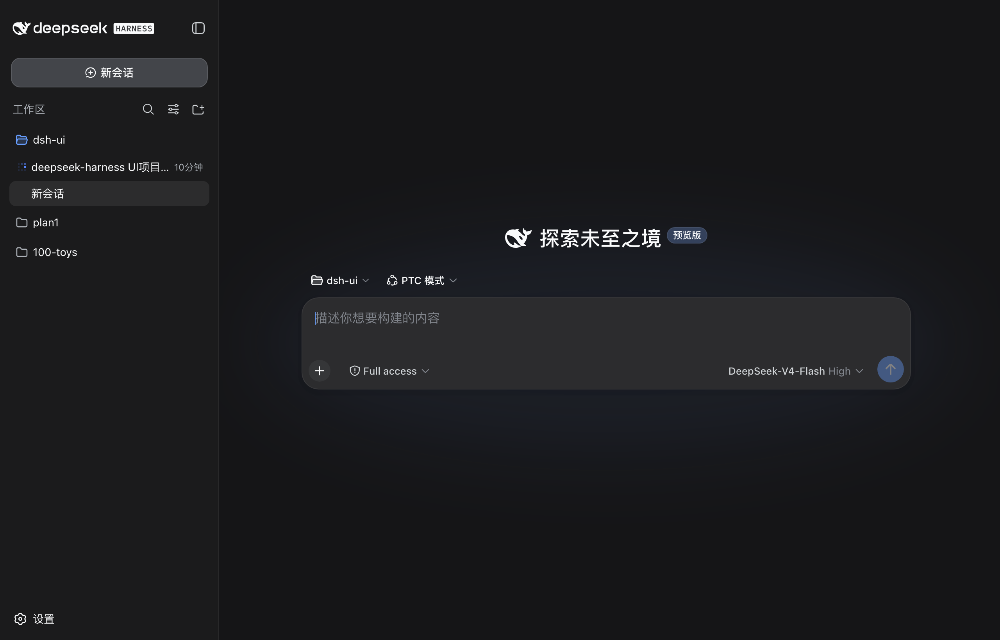
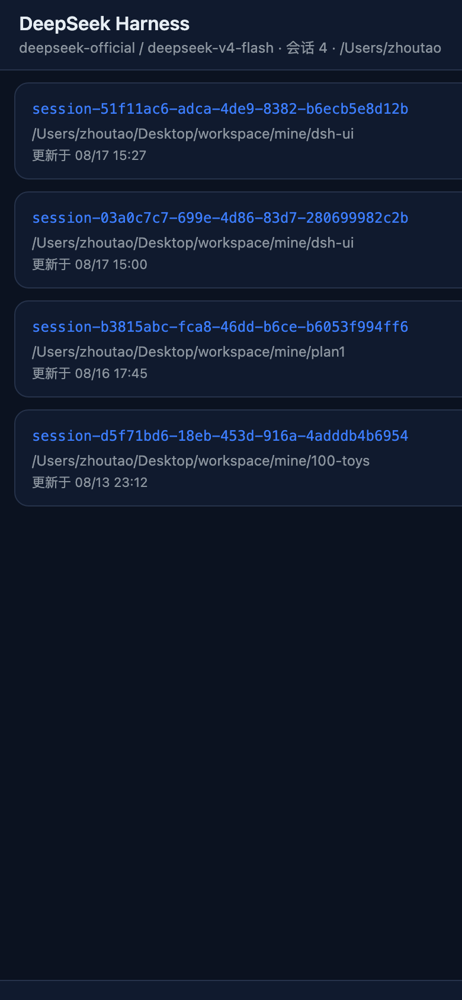
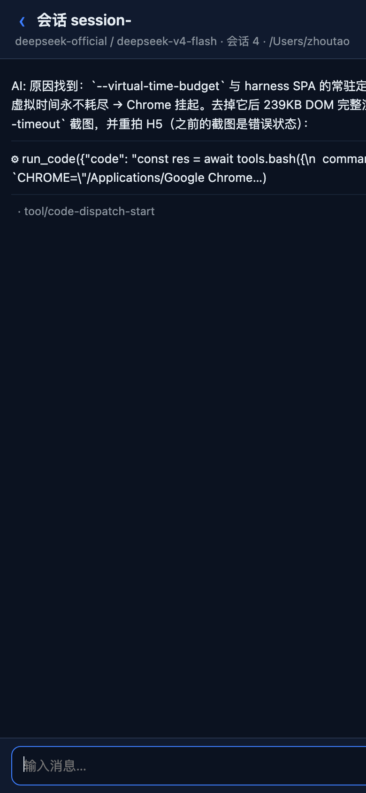
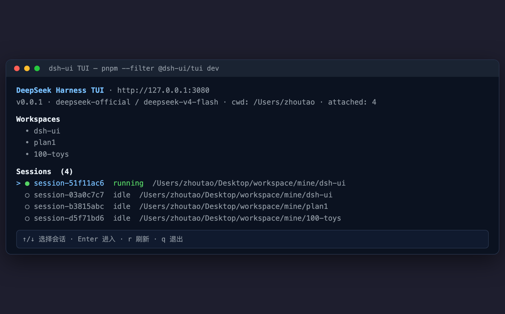
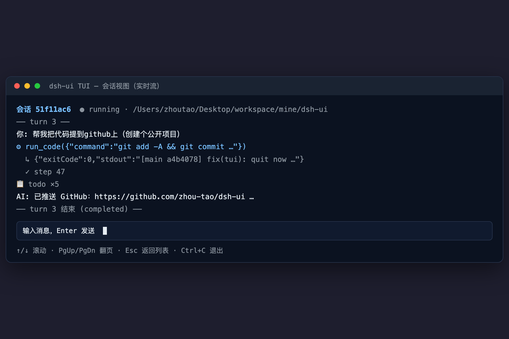
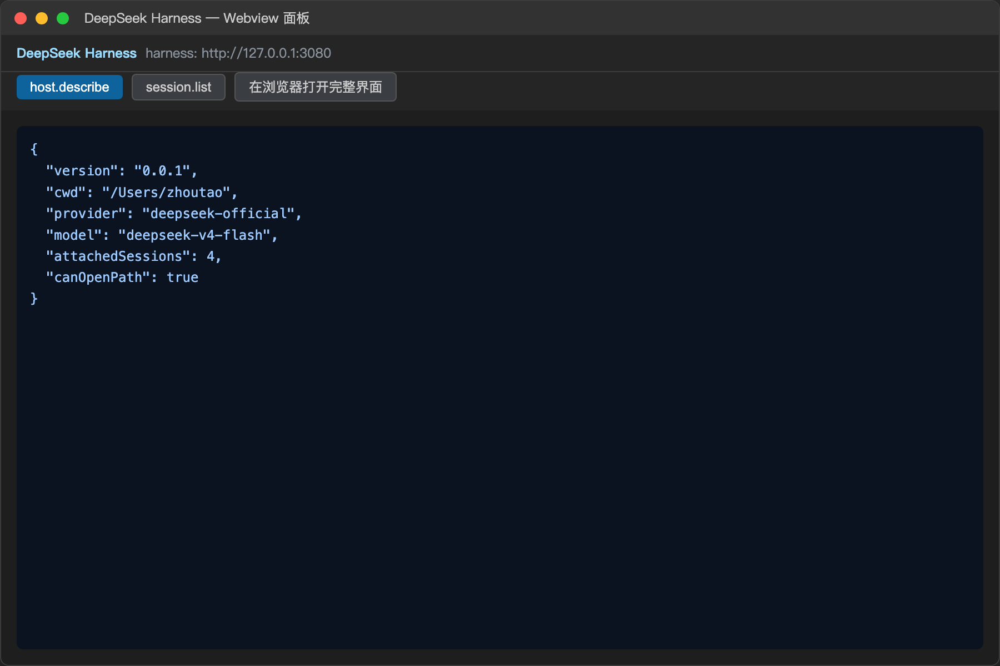

# dsh-ui — DeepSeek Harness UI All-in-One

**[简体中文](README.md) | English**

A UI-client monorepo built for [DeepSeek Harness](https://github.com/deepseek-ai/deepseek-harness): **Desktop app** (Tauri 2) + **Terminal TUI** (Ink) + **Mobile Companion H5** + **VS Code extension**, all sharing the same battle-tested harness protocol.

> Desktop app: **DeepSeek Harness UI** (macOS / Windows) · TUI package: **@dsh-ui/tui** (npm)

---

## ✨ Features

| Client | Capabilities |
| --- | --- |
| 🖥 **Desktop** (DeepSeek Harness UI) | Auto-starts harness, embeds the full web UI in a native window; **phone companion entry**: sidebar phone icon + in-UI modal (same-Wi-Fi LAN QR), auto-loaded QR code, connection status dot |
| 📱 **Mobile H5** | Access from a phone browser: sessions grouped **by workspace**, titles match desktop (title→dirname→sessionId fallback); full messages with **markdown rendering** (code blocks/tables/lists); history loading **slimmed by the bridge** (~10MB → ~100KB); message sending adapted to the latest harness payload |
| ⌨️ **Terminal TUI** (@dsh-ui/tui) | Ink interactive session list/view, live mux stream, message input; `--once` no-TTY mode for CI/pipelines; installable via npm |
| 🧩 **VS Code extension** | Proxy bridge inside a WebviewPanel (strict CSP, no direct network) |
| 📦 **Protocol** (@dsh-ui/protocol) | Zero-dependency wire protocol (envelope/method types/event frames), shared by all four clients, smoke-tested against a live harness |

### How phone companion works (same IP / LAN)
- Desktop starts the bridge service in the background on launch; tap the phone icon → modal with **auto-generated QR code** (zero manual steps);
- Connect phone and computer to the **same Wi-Fi**, scan → browse sessions / send messages;
- Status dot turns **green** when a phone has accessed the bridge within the last 3 minutes;
- Public (cross-IP) access is **under construction** (the original cloudflared tunnel is unreliable in mainland China; marked as placeholder).

---

## 🖼 Screenshots

| Desktop | Mobile H5 (session list) | Mobile H5 (conversation) |
| --- | --- | --- |
|  |  |  |

| TUI (session list) | TUI (conversation) | VS Code extension |
| --- | --- | --- |
|  |  |  |

---

## 📦 Install & Usage

### Prerequisites
- Node ≥ 22, pnpm 9
- Rust toolchain (needed to build the desktop app)
- A running harness (`dsh --profile web`, default 127.0.0.1:3080) — all clients reuse an already-running harness

### 1) Desktop (DeepSeek Harness UI)
```bash
pnpm install
pnpm --filter @dsh-ui/desktop tauri:dev    # dev mode
pnpm --filter @dsh-ui/desktop tauri:build  # package (.dmg / .msi / .exe)
```
- macOS: `DeepSeek Harness UI.app` (builds for both Apple Silicon and Intel); Windows: `.msi` / `.exe`
- Release builds are available from **GitHub Releases**

> **macOS says "app is damaged" on first launch?** That is Gatekeeper's normal block for unsigned builds (misleading wording — the file itself is not corrupted). Pick one:
>
> ```bash
> # Option 1: remove the quarantine flag, then open normally (recommended)
> xattr -dr com.apple.quarantine "/Applications/DeepSeek Harness UI.app"
> open "/Applications/DeepSeek Harness UI.app"
>
> # Option 2: right-click the app → Open → click "Open" again
> ```
>
> Windows SmartScreen works the same way: click "More info" → "Run anyway".

### 2) Mobile Companion H5
```bash
pnpm --filter @dsh-ui/mobile-h5 build   # build frontend
pnpm --filter @dsh-ui/mobile-h5 start   # start bridge service (default port 4173, listens on 0.0.0.0)
```
- Open `http://<MacLANIP>:4173` in the phone browser (IP is shown under the QR code in the desktop modal)
- Deep link: `http://<IP>:4173/?session=<sessionId>`

### 3) Terminal TUI (npm install)
```bash
npm i -g @dsh-ui/tui     # or pnpm i -g @dsh-ui/tui
dsh-tui                  # interactive mode (needs a real terminal)
dsh-tui --once           # one-shot no-TTY print
dsh-tui --once -- --session <sessionId>   # render a session history
```
In-repo development: `pnpm --filter @dsh-ui/tui dev`

### 4) VS Code extension
```bash
pnpm --filter dsh-ui-extension compile
# F5 to run the Extension Development Host
```

### 5) One-shot build / test
```bash
pnpm build       # build the whole workspace
pnpm typecheck   # full type check
pnpm test        # protocol unit smoke tests (no harness needed)
```

---

## 🗂 Project Structure

```
dsh-ui/
├── packages/protocol/       # @dsh-ui/protocol — zero-dep wire protocol (transport + method types + event frames)
├── apps/
│   ├── desktop/             # @dsh-ui/desktop — Tauri 2 desktop (Rust manages the harness process + phone injection)
│   ├── tui/                 # @dsh-ui/tui — Ink v7 terminal client (npm package)
│   ├── mobile-h5/           # Mobile companion H5 + bridge service (same-origin proxy /api, slimmed responses, /qr /status)
│   └── vscode-extension/    # VS Code Webview panel client
├── plugins/                 # dsh plugins (generic capabilities, active once installed into the harness)
│   ├── dsh-deep-ui/         # UI enhancement: collapse thinking traces (worked Xm Xs summary + collapse icon)
│   └── dsh-remote/          # Phone companion (H5 remote): phone icon + QR modal + status dot
└── .github/workflows/       # CI (build/test) + Release (GitHub Release + npm)
```

### Tech notes
- **Protocol** (verified): unary RPC over `POST /api/{method}`, downstream events over WebSocket (`/api/events.mux`); browser and Node carriers
- **Phone bridge**: harness binds 127.0.0.1 and rejects LAN origins → H5 is hosted same-origin by the bridge, which proxies `/api/*`; history responses are filtered (streaming chunks/metadata dropped, 10MB → ~100KB)
- **Cross-IP plan**: the original cloudflared quick tunnel is unreliable in mainland China (marked "under construction"); SSH reverse tunnel (VPS + own domain + Caddy auto-HTTPS) is the next priority

---

## 🔌 dsh Plugins (plugins/)

Generic capabilities are abstracted as harness plugins (client bundles, active once installed). Further UI polish lives in these two plugins:

| Plugin | Capability |
| --- | --- |
| **dsh-deep-ui** | Auto-collapse the AI thinking trace (tool calls/reasoning/steps) after each answer, with a "worked Xm Xs" summary + collapse icon (chevron right/rotate down), answer shown below a divider |
| **dsh-remote** | Phone companion entry: sidebar phone icon + UI modal (same-Wi-Fi QR), connection status dot, auto-loaded QR |

### Install / Uninstall (into the harness profile)

**Auto-installed by the desktop app on startup** (idempotent): before starting/pulling up the harness, the app installs the plugins under
`plugins/` into `~/.dsh/profiles/web` (writes `cordis.patch.yml` + `package.json` deps +
`node_modules` links) — no manual steps; on first run (profile just created) it installs and restarts the harness once so they take effect.
Plugin sources are bundled into the desktop app (`resources/plugins/*`), so release builds work the same way.

Manual install / uninstall (CLI scenarios, e.g. TUI):
```bash
pnpm plugins:install            # write ~/.dsh/profiles/web cordis.patch.yml + deps and pnpm install
# restart the harness (or restart DeepSeek Harness UI) to take effect
pnpm plugins:install --remove   # uninstall
```

> Plugin shape: each plugin is an npm package (`dsh.client` declaration + ModuleLoader bundle via `exports["./client"]` + an empty node half).
> The desktop's built-in inject (inject.js) and dsh-remote are mutually exclusive via `window.__dshPhoneInject`; once the plugin is installed it takes over.
> To switch back to manual management after auto-install, run `pnpm plugins:install --remove` first, then restart the desktop app.

---
## 🚀 Releases (CI/CD)

See `.github/workflows/`:

- **CI** (push / PR): `pnpm install → typecheck → test → build`
- **Release** (push a `v*` tag):
  - Desktop app auto-builds and uploads to **GitHub Release**: `.dmg` for macOS arm64 (Apple Silicon) + x64 (Intel), `.msi` / `.exe` for Windows
  - TUI auto-publishes to **npm** (`@dsh-ui/tui`, requires `NPM_TOKEN` secret)

```bash
git tag v0.1.1 && git push origin v0.1.1   # trigger a release
```

---

## 🤝 Contributing

Issues and PRs are welcome! Please follow these conventions:

1. **Fork + branch**: cut `feat/xxx` or `fix/xxx` from `main`
2. **Local checks** (must pass before submitting):
   ```bash
   pnpm install
   pnpm typecheck   # full type check
   pnpm test        # protocol tests
   pnpm build       # full build
   ```
3. **Protocol changes**: when harness interaction is involved, smoke-test against a live harness (`pnpm --filter @dsh-ui/protocol smoke`) and update types/comments in `packages/protocol`
4. **Commit message**: `feat` / `fix` / `docs` / `chore` + summary (e.g. `fix(desktop): auto-load QR code`)
5. **PR**: describe what changed, how it was verified, and add screenshots for UI changes
6. **Tests**: prefer pure-logic assertions in `packages/protocol` (`pnpm test`) that run without a harness

> Code style: strict TypeScript; `cargo check` with zero warnings on the Rust side; keep zero unnecessary dependencies.

---

## 📄 License

MIT
